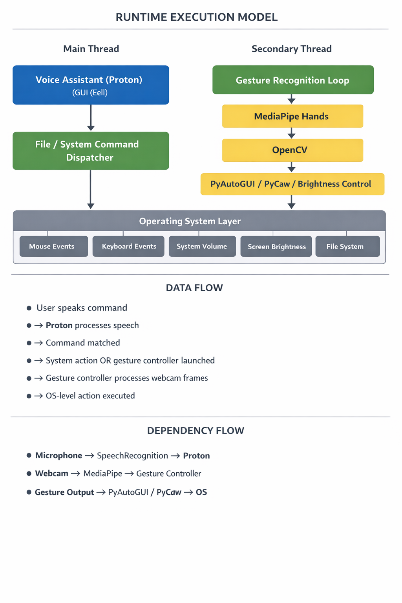

# 🖐️ Gesture Controlled Virtual Mouse & 🎙️ Proton Voice Assistant

    

A **Windows-based Human–Computer Interaction system** that enables **mouse control using hand gestures** and **system automation using voice commands**.

The project combines:

-   **Computer Vision** (MediaPipe Hands)
-   **Speech Recognition** (Google Speech API)
-   **System Automation** (PyAutoGUI, PyCaw, PyWin32)

The system runs **fully offline for gestures** and **online for speech recognition**, and requires **no additional hardware** beyond a webcam and microphone.

---

## 📑 Table of Contents

-   [Key Features](#-key-features)
    
    -   [Gesture Recognition](#%EF%B8%8F-gesture-recognition)
    -   [Voice Assistant – Proton](#%EF%B8%8F-voice-assistant-proton)
-   [System Architecture](#-system-architecture)
    
    -   [Component Responsibilities](#-component-responsibilities)
        -   [Proton (Voice Assistant)](#%EF%B8%8F-proton-voice-assistant)
        -   [Gesture Controller](#-gesture-controller)
    -   [Concurrency Model](#-concurrency-model)
    -   [Data Flow Summary](#-data-flow-summary)
    -   [Architectural Characteristics](#-architectural-characteristics)
-   [Supported Commands](#-supported-commands)
    
    -   [Gesture Recognition Commands](#-gesture-recognition-1)
    -   [Voice Assistant Commands (Proton)](#-voice-assistant--proton-)
-   [Gesture Demonstrations](#-gesture-recognition-)
    
-   [Voice Command Demonstrations](#-voice-assistant---proton--)
    
-   [Getting Started](#getting-started)
    
    -   [Prerequisites](#%EF%B8%8F-prerequisites)
    -   [Installation & Setup](#procedure)
    -   [Running the Application](#run-the-application)
-   [Continuous Integration (CI)](#-continuous-integration-ci)
    
-   [Docker Support](#-docker-support)
    
-   [Known Limitations](#%EF%B8%8F-known-limitations)
    
-   [Design Principles](#-design-principles)
    
-   [License](#-license)
    
---

## ✨ Key Features

### 🖱️ Gesture Recognition

-   Cursor movement
-   Left / Right / Double click
-   Drag & drop
-   Scrolling (vertical & horizontal)
-   Multi-item selection
-   Volume control
-   Brightness control

### 🎙️ Voice Assistant (Proton)

<details>
<summary>Launch / Stop Gesture Recognition</summary>

<ul>
  <li>
    <code>Proton Launch Gesture Recognition</code><br>
    Turns on webcam for hand gesture recognition.
  </li>
  <li>
    <code>Proton Stop Gesture Recognition</code><br>
    Turns off webcam and stops gesture recognition.
    (Termination of Gesture controller can also be done via pressing <code>Enter</code> key in webcam window)
  </li>
</ul>
</details>

<details>
<summary>Google Search</summary>

<ul>
  <li>
    <code>Proton search {text_you_wish_to_search}</code><br>
    Opens a new tab on Chrome Browser if it is running, else opens a new window. Searches the given text on Google.
  </li>
</ul>
</details>

<details>
<summary>Find a Location on Google Maps</summary>

<ol>
  <li>
    <code>Proton Find a Location</code><br>
    Will ask the user for the location to be searched.
  </li>
  <li>
    <code>{Location_you_wish_to_find}</code><br>
    Will find the required location on Google Maps in a new Chrome tab.
  </li>
</ol>
</details>

<details>
<summary>File Navigation</summary>
&emsp;
&emsp;

<ul>
  <li>
    <code>Proton list files</code> / <code>Proton list</code><br>
    Will list the files and respective file_numbers in your Current Directory (by default C:)
  </li>
  <li>
    <code>Proton open {file_number}</code><br>
    Opens the file / directory corresponding to specified file_number.
  </li>
  <li>
    <code>Proton go back</code> / <code>Proton back</code><br>
    Changes the Current Directory to Parent Directory and lists the files.
  </li>
</ul>
</details>

<details>
<summary>Current Date and Time</summary>

<ul>
  <li>
    <code>Proton what is today's date</code> / <code>Proton date</code><br>
    <code>Proton what is the time</code> / <code>Proton time</code><br>
    Returns the current date and time.
  </li>
</ul>
</details>

<details>
<summary>Copy and Paste</summary>


<ul>
  <li>
    <code>Proton Copy</code><br>
    Copies the selected text to clipboard.
  </li>
  <li>
    <code>Proton Paste</code><br>
    Pastes the copied text.
  </li>
</ul>
</details>

<details>
<summary>Sleep / Wake up Proton</summary>

<ul>
  <li>
    Sleep<br>
    <code>Proton bye</code><br>
    Pauses voice command execution till the assistant is woken up.
  </li>
  <li>
    Wake up<br>
    <code>Proton wake up</code><br>
    Resumes voice command execution.
  </li>
</ul>
</details>

<details>
<summary>Exit</summary>

<ul>
  <li>
    <code>Proton Exit</code><br>
    Terminates the voice assistant thread. GUI window needs to be closed manually.
  </li>
</ul>
</details>

---

## 🧠 Project Structure

```
Gesture-Controlled-Virtual-Mouse/
│
├── .dockerignore                     # files to exclude from Docker build
├── .env.example                      # sample environment variables
├── .gitignore                        # git ignore rules
├── ARCHITECTURE.md                   # system architecture documentation
├── CHANGELOG.md                      # version history
├── CODE_OF_CONDUCT.md                # community guidelines
├── CONTRIBUTING.md                   # contribution instructions
├── Dockerfile                        # Docker build config (limited HW)
├── environment.yml                   # conda environment definition
├── LICENSE                           # license file (MIT)
├── README.md                         # main project documentation
├── requirements.txt                  # legacy pip dependencies
│
├── .github/                          # GitHub configuration
│   ├── ISSUE_TEMPLATE/
│   │   ├── bug_report.md             # bug report template
│   │   └── feature_request.md        # feature request template
│   │
│   └── workflows/
│       └── ci.yml                    # GitHub Actions CI pipeline
│
├── .idea/                            # PyCharm IDE settings
│   ├── .gitignore                    # IDE ignore rules
│   ├── copilot.data.migration.ask2agent.xml  # IDE metadata
│   ├── Gesture-Controlled-Virtual-Mouse.iml  # IDE module file
│   ├── misc.xml                      # IDE misc settings
│   ├── modules.xml                   # IDE module mapping
│   ├── vcs.xml                       # VCS integration
│   ├── workspace.xml                 # local workspace config
│   └── inspectionProfiles/
│       └── profiles_settings.xml     # inspection/lint settings
│
├── demo_media/                       # demo GIFs & screenshots
│   ├── palm.gif                      # neutral gesture demo
│   ├── move mouse.gif                # cursor movement
│   ├── left click.gif                # left click gesture
│   ├── right click.gif               # right click gesture
│   ├── double click.gif              # double click gesture
│   ├── drag and drop.gif             # drag & drop
│   ├── Scrolling.gif                 # scrolling gesture
│   ├── multiple item selection.gif   # multi-select gesture
│   ├── Volume control.gif            # volume control
│   ├── Brigntness Control.gif        # brightness control
│   │
│   └── voice commands/               # voice command screenshots
│       ├── proton launch stop gest.png  # launch/stop gestures
│       ├── proton search.png         # search command
│       ├── proton find location.png  # location search
│       ├── proton list files.png     # list files
│       ├── proton open.png           # open file
│       ├── proton go back.png        # go back
│       ├── proton date time.png      # date/time
│       ├── proton copy.png           # copy
│       ├── proton paste.png          # paste
│       ├── proton bye wake up.png    # sleep/wake
│       └── proton exit.png           # exit assistant
│
├── src/                              # application source code
│   ├── app.py                        # Eel GUI bootstrap
│   ├── Proton.py                     # voice assistant logic
│   ├── Gesture_Controller.py         # bare-hand gesture engine
│   ├── Gesture_Controller_Gloved.py  # gloved gesture engine
│   ├── tempCodeRunnerFile.py         # temp IDE file (ignore)
│   │
│   ├── calib_images/                 # camera calibration data
│   │   ├── test.yaml                 # calibration config
│   │   └── checkerboard/             # calibration images
│   │       ├── left01.jpg
│   │       ├── left02.jpg
│   │       ├── left03.jpg
│   │       ├── left04.jpg
│   │       └── left05.jpg
│   │
│   ├── web/                          # frontend (Eel)
│   │   ├── index.html                # main UI page
│   │   ├── css/
│   │   │   └── jquery.convform.css   # UI styles
│   │   ├── images/
│   │   │   ├── icon.png              # app icon
│   │   │   ├── purple-gradient.jpg   # background
│   │   │   └── purple-gradient-bar.png  # header bar
│   │   └── js/
│   │       └── main.js               # frontend logic
│   │
│   └── __pycache__/                  # python bytecode cache
│       ├── app.cpython-38.pyc
│       └── Gesture_Controller.cpython-38.pyc
└──docs/
    └── architecture/
        └── runtime_execution_model.png
```

---

## 🧠 System Architecture

The following diagram illustrates the **runtime execution model**, highlighting the separation between the **main voice assistant thread** and the **secondary gesture recognition thread**.

**High-level components:**



---

### 🔹 Component Responsibilities

#### 🎙️ Proton (Voice Assistant)

-   Captures voice input through the microphone
-   Converts speech to text using `SpeechRecognition`
-   Responds via `pyttsx3` text-to-speech
-   Parses commands using deterministic string matching
-   Launches and stops gesture recognition in a **separate thread**
-   Handles browser, file, and system-level operations
-   Recovers safely from microphone timeouts and stream errors

---

### Architectural Notes

-   Gesture recognition runs in a **separate thread**
-   Voice input is **non-blocking**
-   Microphone stream errors are **gracefully handled**
-   CPU-heavy MediaPipe inference does **not block speech**

---

### 🎤 Supported Commands

> Commands are **string-matched**, not NLP-based.  
> Speak clearly and avoid extra filler words.

---

### ✋ Gesture Controller

-   Captures real-time webcam frames
-   Uses MediaPipe Hands for hand landmark detection
-   Converts hand gestures into mouse and system actions
-   Controls:
    -   Cursor movement
    -   Clicks and drag operations
    -   Scrolling
    -   Volume and brightness
-   Runs independently to avoid blocking voice commands

---

### 🔹 Concurrency Model

-   **Main Thread**
    -   Proton voice loop
    -   Eel-based GUI
-   **Secondary Thread**
    -   Gesture recognition (OpenCV + MediaPipe)

This ensures:

-   Smooth UI experience
-   No blocking during gesture inference
-   Responsive voice command handling

---

### 🔹 Data Flow Summary

1.  User provides input (voice or gesture)
2.  Voice commands are processed by Proton
3.  Commands are matched and dispatched
4.  Gesture Controller runs continuously when enabled
5.  Actions are executed at the OS level

---

### COMPONENT RESPONSIBILITIES

-   Proton (Voice Assistant)
-   Captures voice input via microphone
-   Converts speech to text using SpeechRecognition
-   Generates speech responses using pyttsx3
-   Parses commands using deterministic string matching
-   Dispatches system and file-level commands
-   Launches and stops gesture recognition using threading
-   Handles microphone timeouts and audio stream resets gracefully

---

### Gesture Controller

-   Captures real-time video frames from the webcam
-   Performs hand landmark detection using MediaPipe Hands
-   Interprets static and dynamic hand gestures
-   Converts gestures into mouse and system actions
-   Controls cursor movement, clicks, scrolling, volume, and brightness
-   Runs independently to avoid blocking voice command processing

---

### CONCURRENCY MODEL

-   Main Thread:
    
    -   Voice assistant loop
    -   GUI interaction
-   Secondary Thread:
    
    -   Gesture recognition loop (MediaPipe + OpenCV)

This concurrency model ensures responsive speech recognition and uninterrupted gesture processing.

---

### DATA FLOW SUMMARY

1.  User provides input through voice or hand gestures
2.  Voice commands are processed by Proton
3.  Commands are matched against predefined patterns
4.  Gesture recognition is launched or stopped as required
5.  Hand gestures are continuously analyzed
6.  OS-level actions are executed (mouse, volume, brightness, file access)

---

### ARCHITECTURAL CHARACTERISTICS

-   Platform: Windows
-   Execution model: Thread-based
-   Gesture recognition: Offline (CPU-based)
-   Speech recognition: Online (Google Speech API)
-   Command handling: Deterministic (no NLP or intent inference)
-   Hardware requirements: Webcam and Microphone

This architecture prioritizes **clarity, reliability, and educational value** over abstraction or complex frameworks.

---

### Voice Assistant ( ***Proton*** ):

Launch / Stop Gesture Recognition  


-   `Proton Launch Gesture Recognition`  
    Turns on webcam for hand gesture recognition.
-   `Proton Stop Gesture Recognition`  
    Turns off webcam and stops gesture recognition. (Termination of Gesture controller can also be done via pressing `Enter` key in webcam window)

Google Search  


-   `Proton search {text_you_wish_to_search}`  
    Opens a new tab on Chrome Browser if it is running, else opens a new window. Searches the given text on Google.

Find a Location on Google Maps  


1.  `Proton Find a Location`  
    Will ask the user for the location to be searched.
2.  `{Location_you_wish_to_find}`  
    Will find the required location on Google Maps in a new Chrome tab.

File Navigation  
 
 


-   `Proton list files` / `Proton list`  
    Will list the files and respective file_numbers in your Current Directory (by default C:)
-   `Proton open {file_number}`  
    Opens the file / directory corresponding to specified file_number.
-   `Proton go back` / `Proton back`  
    Changes the Current Directory to Parent Directory and lists the files.

Current Date and Time  


-   `Proton what is today's date` / `Proton date`  
    `Proton what is the time` / `Proton time`  
    Returns the current date and time.

Copy and Paste  


-   `Proton Copy`  
    Copies the selected text to clipboard.
-   `Proton Paste`  
    Pastes the copied text.

Sleep / Wake up Proton  


-   Sleep  
    `Proton bye`  
    Pauses voice command execution till the assistant is woken up.
-   Wake up  
    `Proton wake up`  
    Resumes voice command execution.

Exit  


-   `Proton Exit`  
    Terminates the voice assistant thread. GUI window needs to be closed manually.

---

## Getting Started

### ⚙️ Prerequisites

-   **OS:** Windows 10 / 11 (64-bit)
-   **Python:** 3.8.5 (recommended)
-   **Hardware:**
    -   Webcam
    -   Microphone
-   **Tools:**
    -   Anaconda / Miniconda
    -   Git

> Anaconda Distribution: To download click [here](https://www.anaconda.com/products/individual).

---

### Procedure

```bash
git clone https://github.com/SANJAI-s0/Gesture-Controlled-Virtual-Mouse-with-Proton.git
```

For detailed information about cloning visit [here](https://docs.github.com/en/github/creating-cloning-and-archiving-repositories/cloning-a-repository-from-github/cloning-a-repository).

Step 1:

```bash
conda create --name gest python=3.8.5
```

Step 2:

```bash
conda activate gest
```

Step 3:

```bash
pip install -r requirements.txt
```

Step 4:

```bash
conda install PyAudio
```

```bash
conda install pywin32
```

Step 5:

```
cd src
```

Step 6:

For running Voice Assistant:

```bash
python Proton.py
```

( You can enable Gesture Recognition by using the command "Proton Launch Gesture Recognition" )

Or to run only Gesture Recognition without the voice assistant:

Uncomment last 2 lines of Code in the file `Gesture_Controller.py`

```bash
python Gesture_Controller.py
```

---

### ⚠️ **CI Note**

> Continuous Integration validates dependency installation and core imports only.
> Hardware-dependent modules (microphone, webcam, system audio/brightness)
> are intentionally excluded from CI checks.

---

## 🐳 Docker Support

Docker support is provided for **dependency validation and reproducibility**.

> ⚠️ **Important Limitation:**  
> Webcam, microphone, and OS-level mouse control **do not work inside Docker**. Docker is intended for testing and CI only.

### Build Docker Image

```bash
docker build -t gesture-controlled-virtual-mouse-with-proton .
```

**Run Docker Container**

```powershell
docker run --rm gesture-controlled-virtual-mouse-with-proton
```

> (See Dockerfile in repo root for details.)

---

### ⚠️ Known Limitations

-   Windows-only
-   Google Speech API requires internet
-   No NLP / intent detection (strict string matching)
-   Docker cannot provide full functionality
-   MediaPipe is CPU-intensive on low-end systems

---

### 📐 Design Principles

-   Deterministic behavior
-   Explicit command handling
-   Thread-safe gesture execution
-   Graceful audio error recovery
-   Minimal external dependencies
-   Educational and research-focused
-   Clear separation of concerns
-   User-friendly voice commands
-   Robust error handling
-   Modular architecture
-   Extensive documentation
-   Open-source licensing

---

## 📜 License

This project is licensed under the **GNU General Public License v3.0 (GPL-3.0)**.

You are free to:
- Use the software for personal or commercial purposes
- Modify the source code
- Distribute the software and modifications

Under the conditions that:
- Source code must be disclosed
- Modifications must use the same license (GPL-3.0)
- License and copyright notices must be preserved

See the [LICENSE](LICENSE) file for full details.

---

© 2025 Sanjai

> Educational and development use only.

---
